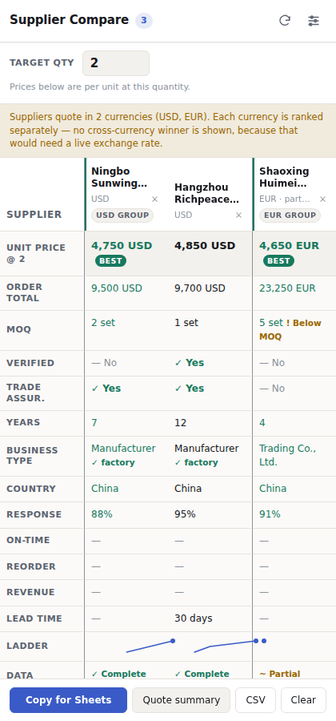

# Alibaba Supplier Compare

A Chrome extension for comparing Alibaba suppliers side by side — tiered prices at the quantity
you actually need, MOQ, and supplier credentials — without juggling 20 browser tabs and a
spreadsheet.



---

## The problem it solves

Sourcing a product on Alibaba means opening dozens of tabs, squinting at price ladders, and
re-measuring which supplier is genuinely cheapest at *your* quantity. A $5,200 headline price
means something different at 1 unit than at 5, and a 2-set MOQ quietly rules out a supplier
entirely.

This extension turns that into one table. It computes the **effective unit price at a target
quantity** for every supplier you add, flags anyone whose MOQ is above that quantity, and sorts the
rest by real cost.

## Features

- **One-click capture.** Press the toolbar button on an Alibaba product page. The side panel opens
  and the product is added.
- **Add a whole results page at once.** On an Alibaba search or supplier-directory page, one press
  adds every supplier currently on screen — name, MOQ, years, verified status, response time,
  on-time delivery, reorder rate and revenue. You do not have to click into 20 product pages first.
- **Transposed comparison matrix.** Suppliers are columns, fields are rows, so three or more
  suppliers read side by side in the panel without horizontal scrolling.
- **Real unit-price math.** A target-quantity field drives every price: the correct tier is
  selected, order totals are computed, and below-MOQ suppliers are flagged rather than quietly
  mispriced.
- **Supplier trust signals.** Verified Supplier, Trade Assurance, years on platform, business type
  (factory vs trading company), response time, on-time delivery, reorder rate, online revenue.
- **Honest data quality.** Every field records which extraction layer read it, and the panel shows
  "not shown" when a page simply does not publish something — it never guesses a `No`.
- **Unpriced suppliers are kept.** A supplier card with no published price is shown with its MOQ and
  credentials, and excluded from ranking rather than hidden.
- **Export to Sheets** (tab-separated, one click, pastes into clean cells), **CSV download**, and a
  **formatted quote summary** for sending to a client or your team.
- **Currency-safe.** Suppliers quoting in different currencies are ranked in separate groups, never
  against each other, because a stale exchange rate would produce a confidently wrong winner.
- **Filters** for verified suppliers, factories only, below-MOQ, and partial data.

## Install

### From source (for development)

1. `git clone` this repository, or download and unzip it.
2. Open `chrome://extensions` in Chrome.
3. Turn on **Developer mode** (top right).
4. Click **Load unpacked** and select this folder.

Requires **Chrome 116 or newer** (for the side panel and `sidePanel.open`).

### Using it

1. **On a search or supplier-directory page** (e.g. `alibaba.com/search/page?SearchScene=suppliers`):
   press the toolbar button once to add every supplier shown on the page. Scroll so the results are
   on screen first — Alibaba replaces the list as you scroll.
2. **On a product page** (a URL containing `/product-detail/`): press the toolbar button to add that
   product with its full tiered price ladder. Repeat for each product you are comparing.
3. Set **Target qty** at the top. The price row re-sorts instantly to the true unit cost at that
   quantity, and anything whose MOQ is above it is flagged.
4. **Copy for Sheets** to paste the table into a spreadsheet, or **Quote summary** to send a clean
   comparison to a client.

The panel tells you which of these applies to the page you are actually on, so it never sits there
looking idle.

## How the extraction works

Alibaba does not put product data in clean HTML. On product pages it ships a large JSON object in
the page source (commonly `window.detailData`). A normal content script cannot read it, because
Chrome isolates extension scripts from page scripts. The extension therefore injects a single
function with `chrome.scripting.executeScript({ world: 'MAIN' })`, which can read the page's own
variables.

Results pages are different: the cards are built from the DOM and there is no single stable JSON
blob, so the results extractor anchors on the product links each card contains, walks up to the
card that owns the link, and label-scans the text. That survives class-name churn better than a
fixed selector list, and it means one card holding five products is one supplier, not five.

The product reader is built in four fallback layers, so a layout change on Alibaba's side degrades
gracefully instead of breaking:

| Layer | Method | Reliability |
|---|---|---|
| 1 | Known paths in the JSON (`componentsVO.*`, `globalData.product.*`) | Best |
| 2 | A recursive walk of that JSON matching field names by pattern | Survives renames |
| 3 | `schema.org` JSON-LD on the page | Good when present |
| 4 | A label scan of the visible page text | Last resort |

**Every field remembers which layer produced it.** If a field ever shows "not found", the panel's
diagnostics can tell you exactly which layer broke — that is the difference between a five-minute
fix and an afternoon of guessing.

### When Alibaba shows a verification screen

Alibaba sometimes interposes a CAPTCHA instead of the product page. It is served as a normal
`200 OK`, so a naive scraper reads it as a product with no data and silently stores a blank
supplier. This extension detects the BaXIA/AWSC markers and shows an explicit
"verification screen" state with a **Re-scan** button, and **saves nothing**. A blank row is worse
than an error, because you would not know to distrust it.

## Diagnosing a broken field

If a field stops appearing, an update to Alibaba's markup is the likely cause.

1. Open the panel's settings (sliders icon) → **Copy diagnostic snapshot**. It copies the field
   provenance report and the key paths the extension found, to your clipboard.
2. To test a candidate field name against real data without touching Alibaba, run the offline
   harness: `npm run serve` (or `python3 -m http.server 8099`) and open
   `http://127.0.0.1:8099/tools/diagnostics.html`. Paste a `window.detailData` blob (or load the
   sample) and press **Test extraction**. It shows every field, which layer read it, and the list of
   key paths to search for a fix.
3. Add the new field name to the matching key pattern in `src/extract/normalize.js`.

## Development

```bash
npm test        # 82 unit tests: comparison math, both extractors, all four layers, exports
npm run icons   # regenerate the PNG icons (pure Python, no dependencies)
npm run preview # render the side panel in a real browser and screenshot every state
npm run verify  # pre-flight checks: manifest, icons, module graph, no remote code
```

The comparison math, both extractors, the four-layer reader and the brace-balanced JSON reader are
all covered by unit tests, including the edge cases that produce a wrong "winner" if they regress —
tier boundaries, below-MOQ pricing, mixed currencies, booleans that are absent rather than false,
and suppliers that have no price at all.

`npm run preview` serves the project and renders the panel in real Chromium, asserting layout
facts rather than just taking pictures: the matrix and the empty state, search and home page
contexts, the verification-screen state, a supplier-origin matrix, and narrow and wide viewports.

## Privacy

Everything stays on your computer in `chrome.storage.local`. No server, no account, no analytics,
no network requests. See [PRIVACY.md](PRIVACY.md).

The extension does **not** request the `tabs` permission, so it cannot read the URL of a tab the
user has not pointed it at. That is why the panel sometimes says "Last seen on: …" rather than
"Currently on: …" — it is telling you the page is from memory, not read live.

## Permissions, and why each is needed

| Permission | Why |
|---|---|
| `activeTab` | Read the one product page you point the button at, only when you press it. This is why the extension does **not** need blanket access to `alibaba.com`. |
| `scripting` | Inject the reader into that one page. |
| `sidePanel` | Show the comparison panel. |
| `storage` | Keep your comparison and settings on your machine. |

## Project layout

```
manifest.json
DESIGN.md                    design system, written before the UI
PRIVACY.md
src/
  background.js              service worker: capture, storage, export
  extract/
    harvest.js               MAIN-world product-page reader (runs inside the page)
    search.js                MAIN-world results-page reader
    normalize.js             four-layer field mapping + provenance
  lib/
    schema.js                record shape, normalisation, confidence
    compare.js               target-quantity math, ranking (pure)
    probe.js                 page classification, CAPTCHA detection, URL routing
    store.js                 local persistence
    exporters/               tsv.js, clientSummary.js, index.js
  panel/                     side panel UI (html/css/js)
tools/
  make_icon.py               pure-Python icon generator (no dependencies)
  diagnostics.html           offline extractor test harness
  panel-preview.mjs          render + screenshot the panel
  verify.mjs                 pre-flight / store-readiness checks
test/                        82 unit tests
docs/screenshots/            panel states
```

## Licence

MIT. See [LICENSE](LICENSE).
